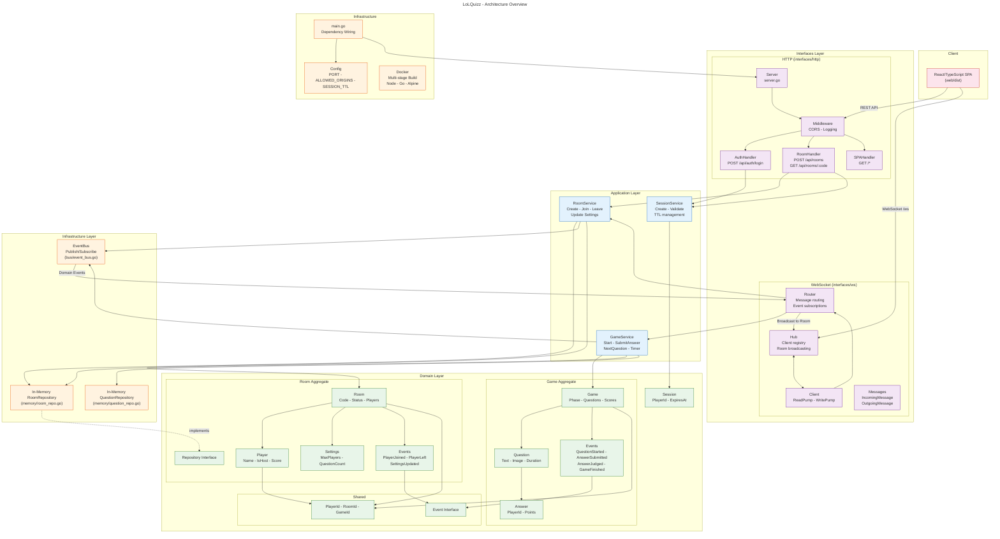

# LoLQuizz - Architecture

## Overview

LoLQuizz is a real-time multiplayer quiz game built with Go (backend) and React/TypeScript (frontend). The architecture follows **Domain-Driven Design (DDD)** with four clean layers.

## Architecture Diagram



## Layers

| Layer | Directory | Purpose |
|-------|-----------|---------|
| **Domain** | `internal/domain/` | Pure business logic — Room/Game aggregates, events, repository interfaces |
| **Application** | `internal/application/` | Orchestration — RoomService, GameService, SessionService |
| **Infrastructure** | `internal/infrastructure/` | Technical details — in-memory repos, EventBus (pub/sub) |
| **Interfaces** | `internal/interfaces/` | External communication — REST API + WebSocket |

## Data Flows

### REST API

```
Client --> Middleware --> Handler --> Service --> Domain --> Repository
```

### WebSocket

```
Client --> Hub --> Router --> Service --> Domain --> EventBus --> Hub --> Broadcast to room
```

### Domain Events

```
Domain Event --> EventBus.Publish --> Router handler --> Hub.BroadcastToRoom --> All clients in room
```

## Key Design Patterns

- **Domain-Driven Design** — Aggregates (Room, Game), value objects, domain events
- **Repository Pattern** — `room.Repository` interface with in-memory implementation
- **Event-Driven Architecture** — EventBus for decoupled pub/sub communication
- **Hub Pattern** — WebSocket Hub manages clients and room-based broadcasting
- **Dependency Injection** — All dependencies wired explicitly in `main.go`

## External Dependencies

| Dependency | Purpose |
|------------|---------|
| `github.com/google/uuid` | UUID generation for player/room/game IDs |
| `github.com/gorilla/websocket` | WebSocket protocol implementation |

## Infrastructure

- **Docker**: Multi-stage build (Node.js -> Go -> Alpine)
- **Config**: Environment variables (`PORT`, `ALLOWED_ORIGINS`, `SESSION_TTL`)
- **Storage**: Fully in-memory (no database)
- **Concurrency**: `sync.RWMutex` + channels for thread-safe operations
